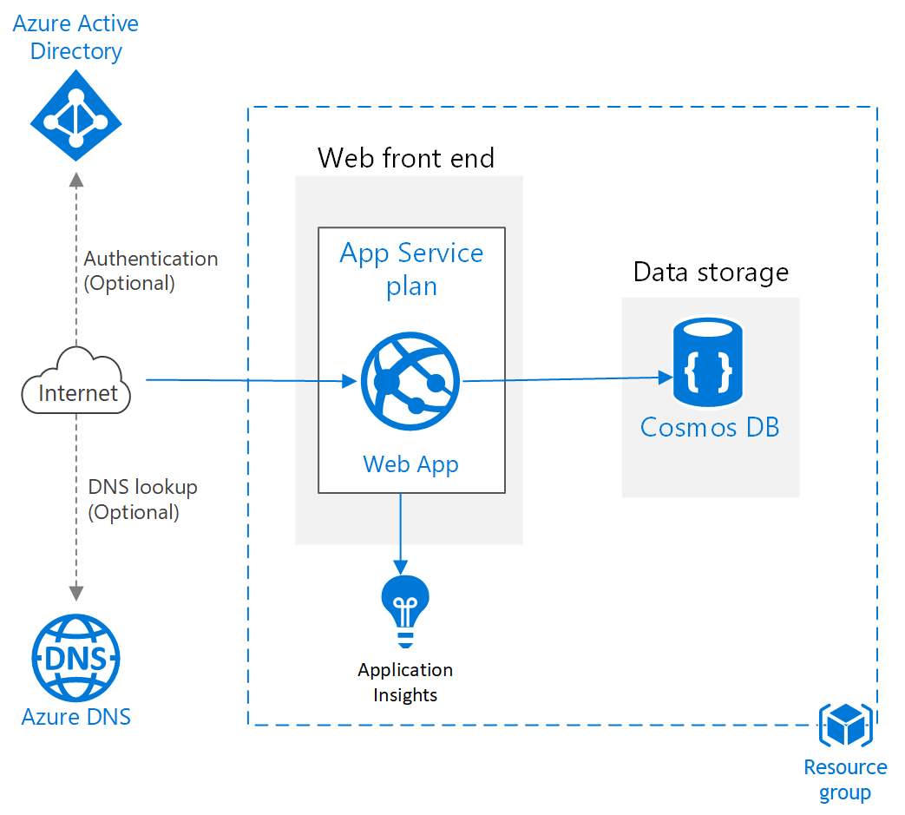

# Market Guru

Market Guru is a lightweight stock quote application which receives user input of stock symbol and provides quotes along with the buy or sell recommendation based on the data. It also stores all the requested information in a persistent data store for further analysis.

## Application Design

We are choosing an MVC based application on dotnet core 3 since it involves user Views for displaying recommendations and trends, Model for data process and controller logic for manipulation.

**User Interface**

A simle UI design plan is provided below.

 

**Application details**

The application leverages Yahoo Finance API which is available as NuGet package OpenSourced in GitHub for getting the stock quote and trend details. 

https://www.nuget.org/packages/YahooFinanceApi/

Below methods are used:

- Yahoo.Symbols() API to get the Market Price, High, Low, Previous close, volume, 10 day averages, etc.
- Yahoo.GetHistoricalAsync() API to get the trend information/historical data. The data period is assumed to be monthly and the duration is selected from Jan 2019 to April 2020.

**Business Logic:**

- Quote color: If current market price of the stock is above previous day close price, then show the stock in green, Otherwise show the stock in red
- Recommendation: If current volume of stock is greater than 10 day average volume and current price is greater than 50 day average, then recommend the stock as buy. Otherwise sell recommendation is provided.

**Data Persistence:**

- Since the data to be persisted involves the user queried stock information and the responses along with trend details which is available readily as json, Cosmos database on Azure is the ideal choice for storing the data as json documents and will be able to query and process the data with SQL APIs. Hence Cosmos DB is used as storage backend.

**Application hosting:**

- The application is hosted on Azure App service leveraging cosmos DB backend. The application configuration is externalized as part of App service configuration settings instead of hard coding the settings as part of application (including Cosmos settings).

 

**Monitoring:**

- Application Insights is used for E2E application monitoring - Logs, metrics collection and tracing. This is a cloud native APM tool which offloads the logging infrastructure management and provides capabilities to effectively monitor the application with dependency tracing with integrated systems (YahooFinanceAPI in this case). Azure SDKs can be added as part of Visual studio project for configuration and the instrumentation key is used to stream the logs and metrics to right endpoint.

**Infrastructure as Code:**

The application uses Infrastructure as Code (IaC) approach and uses  [Azure resource manager (ARM) templates](/arm_template/WebSite.json) for automating the environment provisioning and configuration of the application settings. It creates below resources

- Azure App service Plan
- Azure Web App using the App Service plan
- Azure Cosmos DB for backend persistence
- Azure Application Insights for monitoring of the aapplication
- App Settings configuration for cosmos database and Application Insights

**Testing:**

- Unit Testing is used to test the individual business functionalities of the code using XUnit framework
- Integration testing to be used for testing the system endpoints and external dependencies

**Source control:**

- The application code and Infrastructure resources are stored in GIT cource control. GitHub is used for storing all the information.

**Branching Strategy:**

- Branching strategy can be followed for new application changes, features and can leverage simplistic GitHub Workflow where the master branch is always production deployable code and developers can create their own feature branches and can leverage pull requests for merging new features into master or for colloboration within team.

**Continuous Integration:**

- Azure DevOps Pipelines is leveraged for continuous integration and for building the source code along with unit test execution. Whenever new changes are merged into master, the CI process is triggered automatically which does the build and tests. If tests fail, this results in build failure and email notification for the developer to fix the code. The pipelines are automated and can be readily imported and available as part of source control - [azure-pipelines.yml](azure-pipelines.yml). 

**Continuous Deployment:**

Continuous Deployment is setup as part of Azure DevOps release pipelines which does below tasks:

- Run IaC/ARM templates which provision necessary environment for deployment of the code. This is incremental deployment and helps in ensuring the desired state config before code deployment.
- Deploy the application code on the Azure environment provisioned in previous step.
- This can be extended to run functional tests after the deployment

**Scalability & Deployment:**

- Azure App service scaling can be leveraged to host multiple instances as part of the same application. Autoscaling can be enabled based on metrics like CPU utilization, requests, etc. 
- Azure App Service slots can be leveraged to upgrade the app seamlessly to latest release without downtime and easy rollback. This also helps in blue/green deployment and testing in production capabilities.

**Security:**

Currently Application is hosted as public service without authentication, but this can be extended to enforce security at various levels.

- User authentication using Azure AD integration with App service helps to enforce authentication out-of-box without any application level configuration.
- TLS is used for encryption at transit and storage encryption for encryption at rest
- Application can be hosted within Virtual Network by leveraging App Service environment.
- Application credentials and other configuration details can be securely stored in Azure keyvault and application can leverage key vault using Managed identities to access those resources securely.

**High Availability and Disaster Recovery (HA/DR):**

- Appservice scaling can be leveraged to run the application in multiple instances which helps in HA.
- We can run the application as different app service in multiple regions for global availability and disaster recovery scenarios.
- Using Traffic manager to route the traffic to nearest global endpoint also helps to redirect users to nearest endpoint avoiding the latency of the application.

 